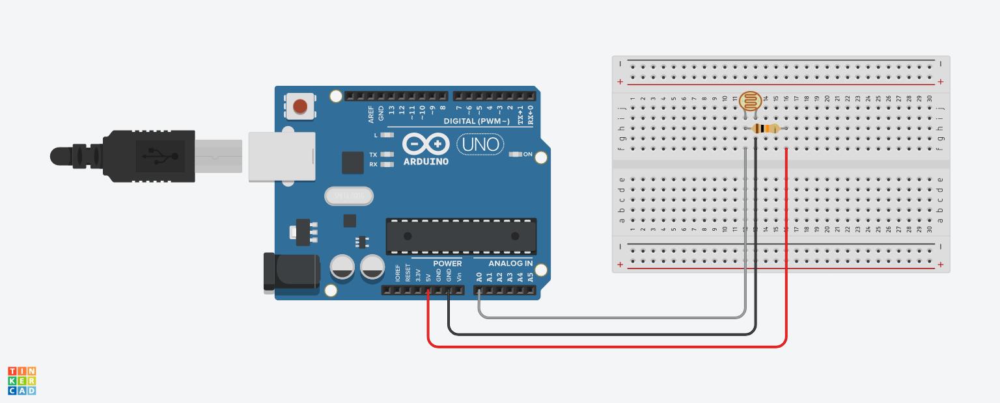

# LDR Sensor Library

This is an Arduino library for interfacing with an LDR (Light Dependent Resistor) sensor. With this library, you can easily read the analog value of an LDR sensor connected to your Arduino board.

## Table of Contents
- [Features](#features)
- [Installation](#installation)
- [Usage](#usage)
- [Full Example](#full-example)
- [Wiring](#wiring)
- [Contributing](#contributing)
- [License](#license)

## Features

- Simple and easy to use
- Supports multiple LDR sensors on the same Arduino board
- Supports all Arduino boards

## Installation

To install this library, download the zip file from the repository and extract it to the `libraries` directory of your Arduino sketchbook. Alternatively, you can clone the repository into your `libraries` directory using Git:
```bash
cd <arduino_sketchbook_directory>/libraries
git clone https://github.com/shadowoff09/LDR-sensor-library.git
```

## Usage

To use this library in your Arduino sketch, include the library header file at the top of your sketch:

```c++
#include <LDR_Sensor.h>
```

Then, create an instance of the LDR_Sensor class, passing in the pin number of the Arduino board that the LDR sensor is connected to:

```c++
LDR_Sensor mySensor(A0);
```

In the setup() function of your sketch, call the begin() function to initialize the LDR sensor:

```c++
void setup() {
  mySensor.begin();
}
```

In the loop() function of your sketch, call the read() function to read the analog value of the LDR sensor:

```c++
void loop() {
  int sensorValue = mySensor.read();
}
```

You can then use the value variable to perform any actions based on the light level detected by the LDR sensor.

## Full Example

```c++
#include <LDR_Sensor.h>

LDR_Sensor mySensor(A0);

void setup() {
  mySensor.begin();
}

void loop() {
  int sensorValue = mySensor.read();
}
```

## Wiring



## Contributing
If you find a bug or have an idea for a feature, feel free to create an issue or pull request on the GitHub repository. Contributions are always welcome!

## License
This library is released under the `MIT License`.